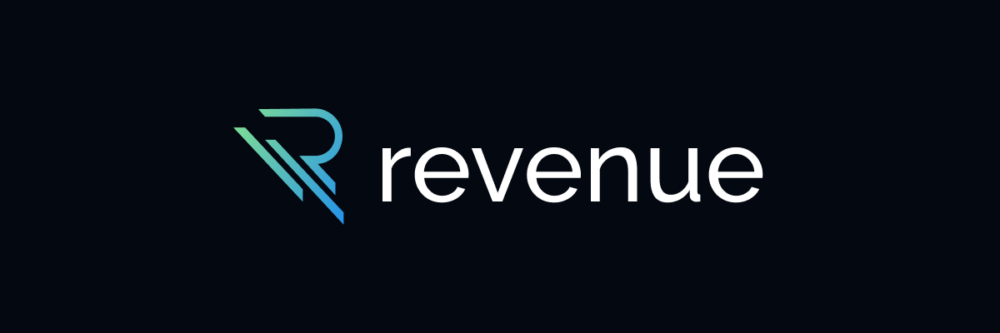

<h1 align="center">Site Contabilidade Revenue</h1>
<h4 align="center">Desenvolvimento Web & UX/UI Design</h4>

  A Revenue é um projeto de estudo <a href="https://revenuecontabilidade.netlify.app/">(acessar site) </a>com intuito de desenvolver todo o branding de uma empresa de contabilidade digital e construir uma interface web que forneça uma ótima experiência ao usuário que acessa-lá. O projeto foi realizado aplicando os temas abordados ao longo das aulas de Desenvolvimento Web da plataforma da <a href="https://dio.me">Digital Innovation One</a> e do <a href="https://cursodefigma.com/">Curso de Figma - Felipe Santana</a>.

  O projeto da Revenue serve como desafio para testar meus conhecimentos e prática dos conceitos de HTML, CSS e Javascript abordados em cursos.

## 📎 Sumário

- [✨ Features](#features)
- [📦 Temas abordados](#topics)
- [👨‍💻 Tecnologias](#tech)
- [🧑🏼‍💻 Site](#site)

#

<h2 id="features">✨ Features</h2>

- Menu de navegação.
- Cabeçalho com animação de scroll.
- Cards com animação de scaling.
- Carroussel de comentários.
- Lógica JS para atualizar os números do site.
- UI Responsiva

*As features são visuais, não possuindo integração com nenhuma API. O intuito do projeto é desenvolvedor a base princiapl de um site institucional*

#

<h2 id="tech">👨‍💻 Tecnologias</h2>

 HTML

 CSS

 Javascript

 Figma

#

<h2 id="topics">📦 Temas abordados</h2>

O projeto possui como intuito aplicar os conceitos de HTML, CSS e Javascript abordados em cursos.

Recursos HTML/CSS presentes no projeto:

- Estrutura semântica
- Organização
- Fundamentos do CSS
- Grid Layout
- Flexbox
- Responsividade
- Pseudo-elementos
- Pseudo-classes
- Transformações 2D e 3D
- Transições e animações

#

<h2 id="site">🧑🏼‍💻 Site</h2>

- <h3>Venha conhecer o site da <a href="https://revenuecontabilidade.netlify.app/">Revenue.</a></h3>

- <h3>Conheça também a identidade da  <a href="https://www.behance.net/gallery/164987245/Contabilidade-Revenue">Revenue.</a></h3>

